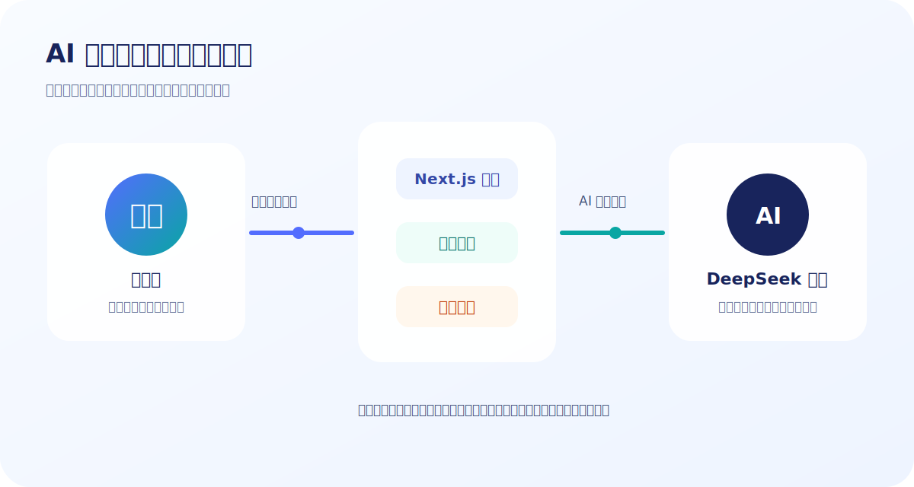
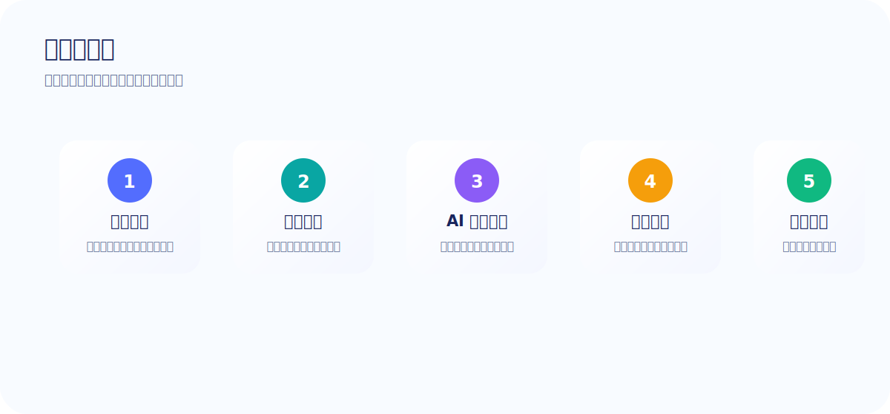
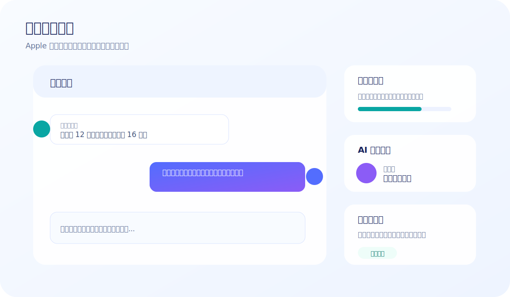

# AI 校园商务谈判官作品介绍

## 一、作品一句话介绍

**AI 校园商务谈判官**是一款面向大学生的 AI 商务沟通训练平台。它把“真实校园经济场景”“AI 谈判对手”“实时评分反馈”“语音交互”“成交判断”“复盘报告”和“游戏化成就”结合在一起，帮助学生在可重复、低成本、无风险的环境中练习谈薪、报价、合作、议价和风险识别能力。

如果用一句产品化表达来概括：  
**这不是一个简单的 AI 聊天网页，而是一个能陪大学生练商务谈判、帮学生看见表达问题、训练风险意识和积累谈判经验的 AI 实训产品。**



## 二、项目背景

大学生正在越来越多地参与校园经济活动，例如兼职、接单、社团商业合作、校园创业、二手交易、知识付费推广等。这些活动看似简单，实际都包含典型的商务沟通问题：

- 兼职时如何谈薪资、排班、试用期和结算方式？
- 接单时如何报价、定义交付范围、避免无限修改？
- 创业合作时如何说明价值、争取资源、控制试点风险？
- 二手交易时如何议价、验货、避免先转账风险？
- 面对强势甲方或压价型客户时，如何不被对方带节奏？

传统课堂可以讲理论，但很难提供大量真实对话训练。学生真正缺的不是“知道谈判很重要”，而是缺少一个可以反复练习、即时反馈、失败也没有真实损失的训练环境。

因此，本作品希望解决一个非常具体的问题：  
**让大学生在进入真实商业沟通之前，先通过 AI 模拟训练获得谈判经验。**

## 三、目标用户

本产品的核心用户是有校园经济活动需求的大学生，主要包括：

| 用户类型 | 典型需求 | 产品价值 |
| --- | --- | --- |
| 找兼职的学生 | 谈薪资、问结算、确认工作内容 | 避免低薪、模糊排班和押金风险 |
| 接单型学生 | 做 PPT、设计、剪辑、摄影、开发等 | 学会报价、定义交付边界、避免无限修改 |
| 校园创业团队 | 与商家、供应商、社团资源方合作 | 训练商业模式表达和数据化说服 |
| 二手交易用户 | 买卖电脑、相机、电动车、教材等 | 练习议价、验货和平台交易意识 |
| 创新创业课程学生 | 需要模拟商业沟通实践 | 可作为课堂实训和作业成果工具 |

产品也适合教师在数字经济、创新创业、职业规划、商务沟通课程中使用，让学生完成一次完整的“谈判训练 + 复盘报告”。

## 四、用户痛点

### 1. 不敢谈

很多学生在真实沟通中会担心“说多了不好意思”“报价高了别人不要”“问太细显得麻烦”，结果在还没有明确条件时就先退让。

### 2. 不会谈

学生常见表达是：

- “能不能多一点？”
- “我觉得这个价格有点低。”
- “我都可以。”
- “你看着给吧。”

这些表达缺少依据，也没有谈判结构，很容易被对方压价。

### 3. 不会守底线

一旦对方提出“先试用”“后面再涨”“先交资料费”“你先做一版看看”，很多学生容易直接答应，忽视自己的时间成本和风险。

### 4. 不会复盘

真实沟通结束后，学生往往只知道“谈成了”或“没谈成”，但不知道自己输在哪里：是报价没有依据？是交付范围没定义？是风险没有识别？还是过早让步？

AI 校园商务谈判官的核心价值，就是把这些模糊问题变成可训练、可反馈、可复盘的能力指标。

## 五、产品定位

本产品定位为：  
**大学生校园商务场景下的 AI 谈判实训平台。**

它与普通聊天机器人的区别在于：

| 对比项 | 普通 AI 聊天 | AI 校园商务谈判官 |
| --- | --- | --- |
| 目标 | 回答问题 | 训练谈判能力 |
| AI 身份 | 助手、老师、百科 | 固定扮演谈判对手 |
| 对话方式 | 用户问，AI 答 | 多轮博弈、压价、追问、施压 |
| 反馈机制 | 通常没有结构化评分 | 实时热力条、称号、成就、复盘 |
| 场景约束 | 泛化场景 | 校园兼职、接单、创业、二手交易 |
| 结束判断 | 不一定识别成交 | 自动判断成交、未达预期或继续谈 |
| 训练价值 | 信息获取 | 能力提升 |

## 六、核心使用流程

用户进入平台后，会经历完整的训练闭环：

1. **选择训练场景**：从兼职谈薪、自由职业接单、创业合作、二手交易中选择。
2. **设置训练参数**：填写自己的身份、AI 对手角色、谈判目标、底线、难度和对手风格。
3. **进入 AI 对话训练**：AI 对手以不同性格登场，用户通过文字或语音进行谈判。
4. **实时查看状态**：系统显示信任度、压力、成交可能性和风险等级。
5. **终局判断**：AI 判断本轮是否成交、未达预期或仍需继续。
6. **生成复盘报告**：输出优势、不足、风险提示、改进建议和下一步训练方向。
7. **获得称号与成就**：通过游戏化反馈激励继续训练。



## 七、核心功能介绍

### 1. 多场景训练库

平台内置四类高频校园商务场景：

**学生兼职谈薪**  
训练学生与雇主沟通薪资、试用期、排班、工作内容和结算方式。该场景尤其关注押金、资料费、试岗无薪、模糊结算等风险。

**自由职业接单报价**  
模拟学生设计师、剪辑师、摄影师、PPT 制作者、程序开发者与甲方沟通报价和交付范围。重点训练报价依据、分层报价、修改次数、交付边界和付款节点。

**校园创业项目谈合作**  
模拟创业团队与商家、供应商、社团负责人或资源方谈合作。重点训练商业模式表达、数据化说服、试点方案、资源置换和风险共担。

**二手交易议价**  
模拟校园二手交易中的买卖沟通。重点训练合理定价、砍价回应、验货流程、平台交易和先转账风险识别。

### 2. AI 对手性格系统

产品不是让 AI 一味配合用户，而是让 AI 成为有压力感的谈判对手。系统支持四类 AI 对手风格：

- **友好型**：愿意沟通，但仍然关注价格和条件。
- **怀疑型**：不断追问依据、能力、数据和可靠性。
- **压价型**：持续要求降价、试探用户底线。
- **强势型**：制造时间压力，提高要求，测试用户是否会让步。

这种设计让训练更接近真实谈判，因为真实对手不会永远顺着你说。

### 3. AI 对手出场动画

进入训练时，系统会显示 iOS 风格的玻璃卡片出场动画，例如：

- “压价型甲方客户登场”
- “怀疑型客户登场”
- “强势型招聘负责人登场”

这种设计让用户一进入训练就知道对手是什么性格，也让产品更有沉浸感和趣味性。

### 4. 语音交互与 AI 朗读

为了让训练更接近真实沟通，产品加入了语音交互能力：

- 用户可以点击“语音输入”，直接说出回复。
- AI 回复可以自动朗读。
- AI 正在朗读时，头像旁边会出现动态声波。
- 用户可以手动朗读上一句，也可以停止朗读。

这让训练不只是文字输入，而更像与真实对手进行口语谈判。

### 5. 实时谈判热力条

平台会在训练过程中展示四个动态指标：

- **对方信任度**：用户的表达是否让对方更愿意继续谈。
- **谈判压力**：当前局势是否被对方压制。
- **成交可能性**：本轮谈判达成目标的概率。
- **风险等级**：是否出现押金、先转账、模糊结算等风险。

这些指标让用户不再凭感觉判断，而是可以看到谈判状态的变化。

### 6. 训练评分模型

系统从六个维度评估用户表现：

| 维度 | 说明 |
| --- | --- |
| 价值表达 | 是否说清楚自己能提供什么价值 |
| 数据说服 | 是否使用价格、周期、人数、成本等具体依据 |
| 风险意识 | 是否识别押金、资料费、先转账、模糊交付等问题 |
| 底线控制 | 是否明确底线、条件、前提和不可接受项 |
| 专业度 | 表达是否礼貌、清晰、可执行 |
| 成交概率 | 当前对话是否接近达成目标 |

### 7. 成交与未达预期判断

谈判系统最重要的一点是：**一旦谈判已经结束，就不能继续乱聊。**

因此本作品加入了终局判断逻辑：

- 如果双方已经明确约定价格、时间、合作方式或自然收尾，例如“那到时候见”，系统判断为“谈判成交”。
- 如果双方条件差距过大、拒绝继续、目标没有达成，则显示为“未达预期”。
- 成交或未达预期后，系统会锁定输入区，引导用户生成复盘报告。

这让产品更像一个训练系统，而不是无限聊天窗口。

### 8. 复盘报告

训练结束后，系统会生成结构化复盘报告，包括：

- 本轮谈判总结
- 成交状态和成交概率
- 本轮优势
- 本轮不足
- 风险提示
- 改进建议
- 更好的回复示例
- 数字经济相关解释
- 下一次训练建议

复盘报告的价值在于：用户不仅知道结果，还知道自己下一次应该怎么说。

### 9. 谈判称号与训练成就

为了增强趣味性和持续使用动力，系统会根据表现给出称号和成就。

谈判称号示例：

- 风险雷达
- 稳健报价官
- 反压价高手
- 数据说服型选手
- 过早让步预警
- 稳步推进型谈判者

训练成就示例：

- 第一次守住底线
- 成功识别押金风险
- 提出分层报价
- 完成 3 轮不让步谈判
- 用数据说服对方

这些反馈能让用户明确感受到自己不是“随便聊了一轮”，而是真的完成了一次能力训练。

### 10. 历史训练成长曲线

系统会记录最近几次训练表现，并展示成长趋势：

- 风险意识是否提升
- 底线控制是否变好
- 成交概率是否提高

这让平台从一次性体验变成长期训练工具。

### 11. 每日挑战

首页提供每日挑战入口，例如：

- 今日挑战：压价型甲方
- 今日挑战：资料费兼职骗局
- 今日挑战：二手交易先转账风险

每日挑战可以降低用户开始训练的门槛，让用户不用思考太久就能直接进入高价值训练。



## 八、产品亮点

### 亮点一：把 AI 从“回答者”变成“对手”

很多 AI 产品只会回答用户问题，但谈判训练需要的是对抗性和压力感。本作品让 AI 固定扮演对手，根据风格压价、追问、怀疑或施压，让用户真正进入谈判状态。

### 亮点二：更贴近大学生真实生活

产品没有选择过于宏大的商业并购、公司合同等场景，而是聚焦大学生最常遇到的校园经济场景。越贴近生活，训练越容易被理解和使用。

### 亮点三：结果导向，不让对话无限发散

系统会判断成交、未达预期和继续谈三种状态。成交后弹出结束提示，避免 AI 已经谈成了还继续乱聊。

### 亮点四：反馈可视化

热力条、称号、成就、成长曲线和复盘报告让用户能看见自己的变化。相比单纯聊天，这种可视化反馈更适合教学和作品展示。

### 亮点五：语音和动画增强沉浸感

AI 对手出场、头像、声波、弹窗和页面转场，让产品不再像普通表单，而更像一个完整的训练应用。

## 九、界面设计理念

视觉风格参考 Apple 产品的设计语言，强调：

- 浅色背景
- 玻璃拟态面板
- 柔和阴影
- 克制的渐变
- 清晰的信息层级
- 顺滑的转场动画
- 圆角但不过度卡通化

产品界面希望传达的感觉是：**轻量、现代、可信、适合学习，也有一点游戏化乐趣。**

## 十、典型使用场景

### 场景一：学生准备去奶茶店兼职

学生可以选择“学生兼职谈薪”，设置自己的底线薪资和工作时间，AI 扮演店长进行谈判。训练后，学生能学会主动询问试用期、排班、结算周期和是否存在押金。

### 场景二：学生接 PPT 制作单

学生选择“自由职业接单报价”，AI 扮演压价型甲方。学生需要说明价格依据、交付范围、修改次数和付款方式。系统会判断学生是否过早让步。

### 场景三：校园创业团队找商家合作

学生选择“校园创业项目谈合作”，AI 扮演怀疑型商家老板。学生需要用数据说明用户规模、转化路径和试点方案，提高合作可信度。

### 场景四：二手交易避免被骗

学生选择“二手交易议价”，AI 扮演要求先转账的买家或卖家。系统会检测学生是否提出平台交易、验货、确认成色等安全条件。

## 十一、技术实现

作品使用现代 Web 技术开发：

| 模块 | 技术 |
| --- | --- |
| 前端框架 | Next.js 16 App Router |
| 编程语言 | TypeScript |
| UI 样式 | Tailwind CSS 4 |
| 图标系统 | lucide-react |
| 图表展示 | Recharts |
| AI 接口 | DeepSeek 兼容 OpenAI Chat Completions API |
| 数据存储 | localStorage 本地训练记录 |
| 语音能力 | Web Speech API |

系统包含两个主要 AI API：

- `/api/chat`：负责生成 AI 对手回复，并结合规则与 AI 裁判判断谈判状态。
- `/api/report`：负责生成结构化复盘报告。

## 十二、系统结构

```text
src
├─ app
│  ├─ page.tsx                 首页
│  ├─ scenarios/page.tsx        场景选择页
│  ├─ setup/[scenarioId]        参数设置页
│  ├─ training/[sessionId]      对话训练页
│  ├─ report/[sessionId]        复盘报告页
│  └─ api
│     ├─ chat/route.ts          AI 对话接口
│     └─ report/route.ts        AI 复盘接口
├─ components                   页面组件与互动组件
├─ data/scenarios.ts            训练场景数据
├─ lib/engine.ts                训练评分与会话逻辑
├─ lib/engagement.ts            称号、成就、热力条逻辑
└─ types/index.ts               TypeScript 类型定义
```

## 十三、与传统教学方式的区别

传统商务沟通教学通常是“老师讲方法，学生听案例”。本产品的方式是“学生直接进入情境，AI 立即反馈，系统自动复盘”。

| 教学方式 | 特点 | 局限 |
| --- | --- | --- |
| 理论讲授 | 知识完整 | 学生缺少实战感 |
| 同学角色扮演 | 有互动 | 成本高、反馈不稳定 |
| 案例分析 | 能总结经验 | 不一定能练表达 |
| AI 校园商务谈判官 | 可重复、多场景、即时反馈 | 需要持续优化场景库 |

## 十四、可推广价值

本作品可以用于多个方向：

1. **创新创业课程实训**：作为课程作业，让学生完成一次商业谈判训练并提交复盘报告。
2. **职业沟通训练**：帮助学生提升谈薪、报价、表达价值的能力。
3. **校园反诈教育**：通过资料费、押金、先转账等场景训练风险识别。
4. **数字经济课程案例**：解释平台交易、信息不对称、交易成本、信用机制等概念。
5. **学生社团商业合作培训**：训练社团负责人和商家沟通赞助、资源置换和合作边界。

## 十五、未来规划

后续可以继续扩展以下方向：

- 增加更多场景：社团赞助谈判、实习薪资谈判、课程项目外包、校园摊位合作。
- 增加多人模式：支持学生之间分组 PK，比较谈判策略。
- 增加教师端：教师可以查看学生训练次数、得分和复盘报告。
- 增加语音评分：分析语速、停顿、礼貌程度和表达清晰度。
- 增加更丰富的对手画像：不同年龄、行业、预算、决策风格。
- 增加导出功能：一键导出训练报告 PDF 或 Word。
- 增加排行榜和训练等级：提升长期使用动力。

## 十六、运行方式

在项目目录中运行：

```bash
npm install
npm run dev
```

浏览器访问：

```text
http://localhost:3000
```

生产构建命令：

```bash
npm run build
```

## 十七、作品总结

AI 校园商务谈判官的核心竞争力在于：它把 AI 对话能力转化成了一个完整的训练产品。用户不是简单地和 AI 聊天，而是在具体场景中面对一个有性格、有压力、有目标的谈判对手，并通过实时反馈和复盘报告看到自己的能力变化。

对于学生来说，它是一个可以反复练习商务沟通的安全训练场。  
对于老师来说，它是一个可以辅助课程实践和作业评价的数字化工具。  
对于校园经济场景来说，它能帮助学生更理性地谈价格、谈条件、识别风险、保护自己的劳动价值。

因此，本作品不仅具有展示性，也具有实际使用价值和继续迭代的空间。
